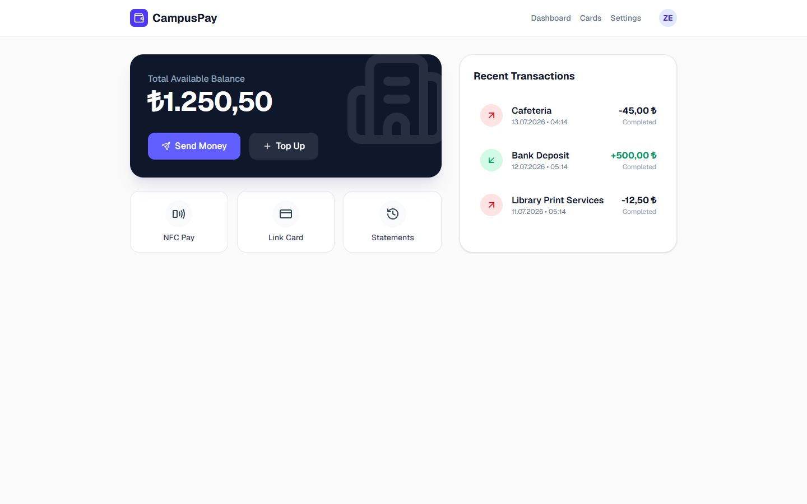

# CampusPay - Campus Digital Wallet Web3 DApp

**Author:** Zanyar Erkozan

---

## 📋 Overview
CampusPay is a full-stack Digital Wallet Application engineered specifically for university campuses. Originally conceptualized in my Software Design Description (SDD) and Software Requirements Specification (SRS) documentation, this repository brings the architecture to life as a functional, interactive web application.

The application allows students to securely manage their campus funds, top-up their balances via mock external banking gateways, and perform peer-to-peer (P2P) transfers using student ID routing.

## ⚙️ Core Features
- **Real-Time Financial Dashboard:** Interactive UI tracking total available balance and transaction history.
- **P2P Transfer Engine:** Enables instant internal transfers between students/facilities (e.g., Cafeteria, Library Print Services) with full ledger tracking.
- **Top-Up Gateway Simulation:** Allows external simulated deposits into the campus wallet via Credit Card.
- **Interactive Modals:** Built with `framer-motion` for fluid, native-app-like user experiences when sending money or depositing funds.
- **Robust API Backend:** Built on Next.js Serverless API routes (`/api/transaction`) featuring state simulation and network latency mirroring.

## 🛠️ Technology Stack
- **Framework:** Next.js 14 (App Router)
- **Styling:** Tailwind CSS
- **Animations:** Framer Motion
- **Icons:** Lucide React
- **Language:** TypeScript

## 📸 Screenshots

*(This is a locally developed prototype. Below is an actual screenshot of the working application.)*



## 🚀 Local Development Showcase

This application was designed, built, and tested locally. It is intended to showcase my ability to build complex, production-ready, full-stack applications.

If you wish to run it locally:
1. **Install dependencies:**
   ```bash
   npm install
   ```
2. **Run the development server:**
   ```bash
   npm run dev
   ```
